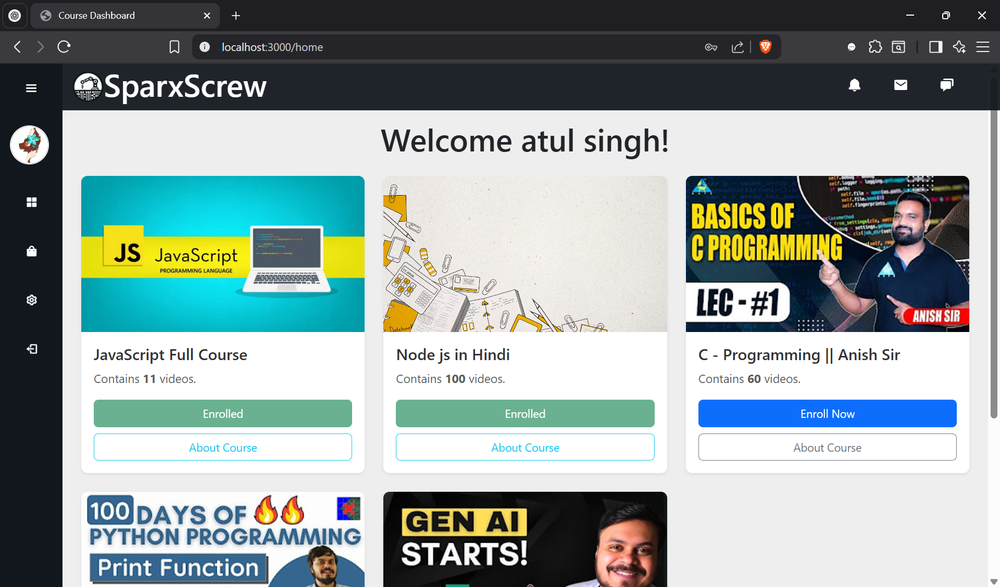
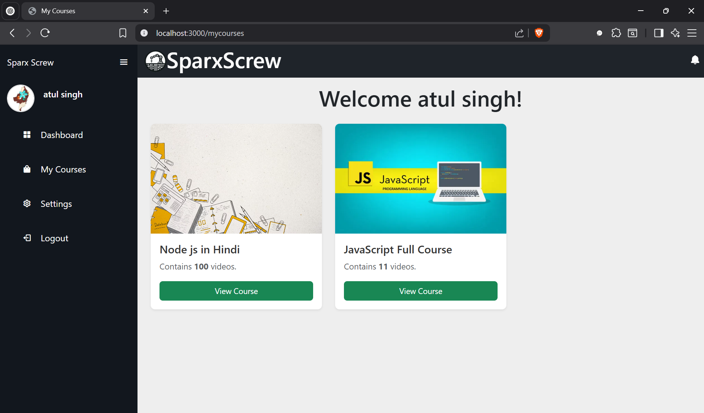
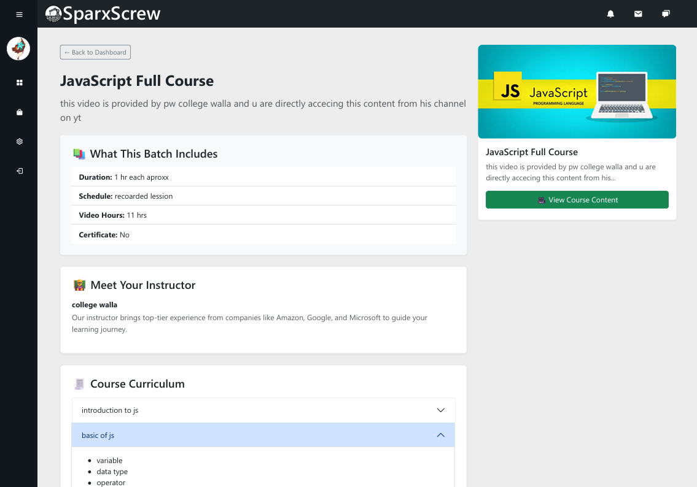
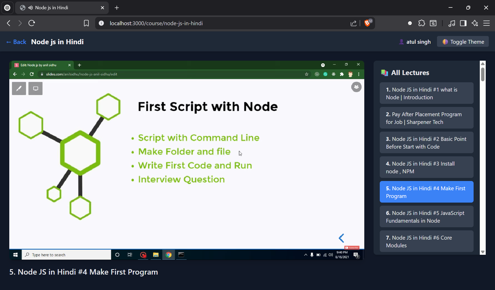
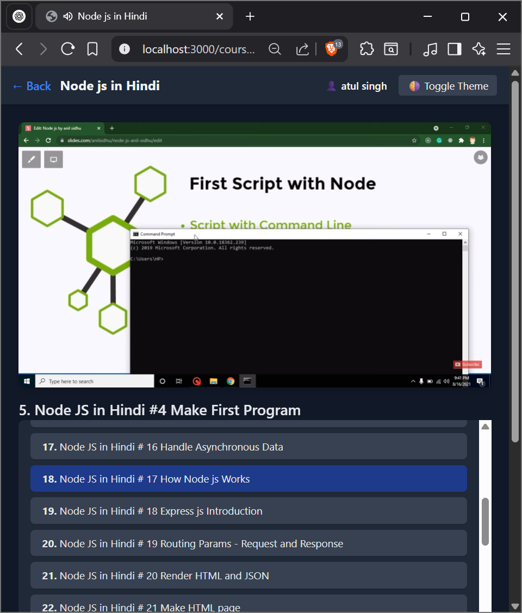
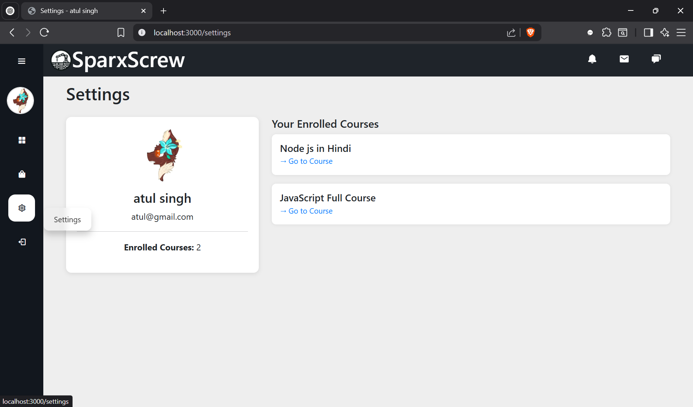

# youtube-course-platform
A full-stack learning platform built with Node.js, Express, MongoDB, and EJS where users can browse, enroll in, and watch YouTube-based courses. Includes an admin dashboard to add playlists, manage course details, and structure curriculum.

## 🚀 Features

### 👨‍🎓 User Side
- Browse all available courses
- Enroll in courses (session-based login)
- Watch YouTube videos in sequence
- View course curriculum and details
- View enrolled courses (My Courses)

### 🛠 Admin Panel
- Admin authentication (login required)
- Add new courses via YouTube playlist URL
- Auto-fetch playlist videos using `ytpl`
- Fill out course info (description, instructor, etc.)
- Add structured curriculum modules and topics
- Edit existing course content and structure

---

## 🧰 Tech Stack

| Layer     | Tech Used                            |
|-----------|---------------------------------------|
| Backend   | Node.js, Express.js                   |
| Database  | MongoDB (Mongoose ODM)                |
| Views     | EJS templating engine                 |
| Frontend  | Bootstrap 5, Vanilla JS               |
| Auth      | express-session, bcrypt               |
| YouTube   | ytpl (fetch playlist metadata)        |

---

### 📁 Folder Structure

<pre>
youtube-course-platform/
├── models/         # Mongoose schemas
├── routes/         # All backend routes
├── views/          # EJS templates
├── public/         # CSS, JS, images
├── scripts/        # Optional: tools for inserting playlists into DB
├── app.js          # Main entry point
├── .env            # Config vars
└── README.md
</pre>
---

# 🎓 YouTube Course Platform

A Node.js-based YouTube course viewer and admin system built using Express.js, MongoDB, and EJS. Allows users to register, enroll in playlist-based courses, and watch content. Admins can manage courses, upload playlists, and edit curriculum.

---

## 🚀 Features

- User registration/login
- Enroll in courses (YouTube playlists)
- View curriculum & video content
- Admin panel for adding/editing courses
- Clean Bootstrap-based UI

---

## 🛠 Setup Instructions

1. Clone the repository:

   git clone https://github.com/Atul04singh/youtube-course-platform

2. Install dependencies:

   npm install

3. Start MongoDB (ensure it's running locally)

4. Run the application:

   npm run dev  
   or  
   nodemon app.js

Visit: http://localhost:3000

---

## 📸 Screenshots

🖼 Home Page

🖼 My Courses

🖼 About Course

🎥 Course View

  
  

🛠 Settings

---

